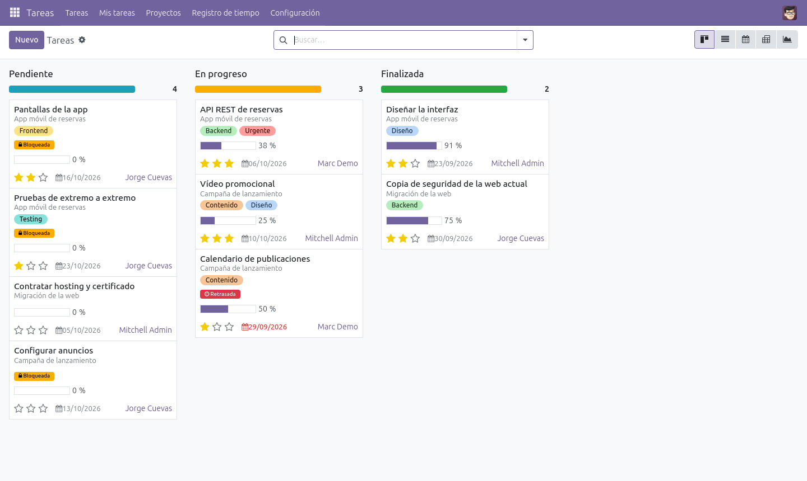
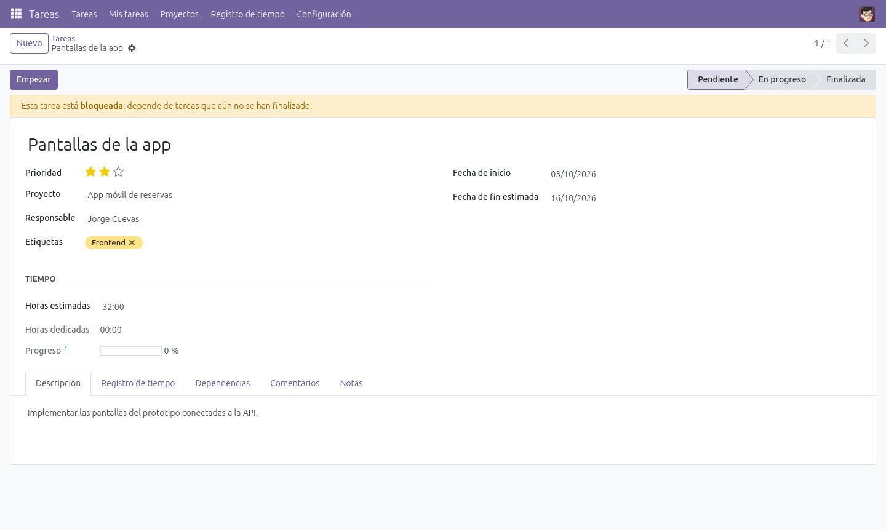
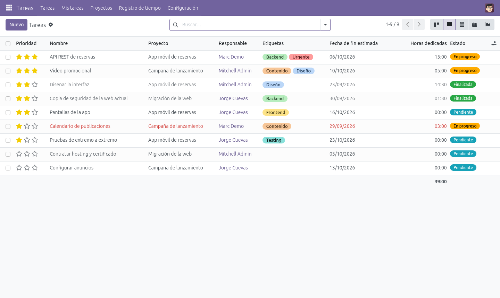
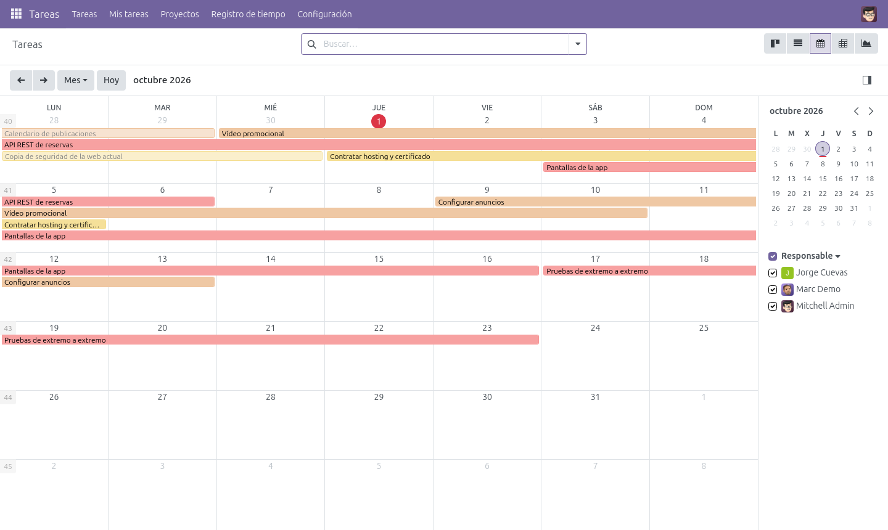
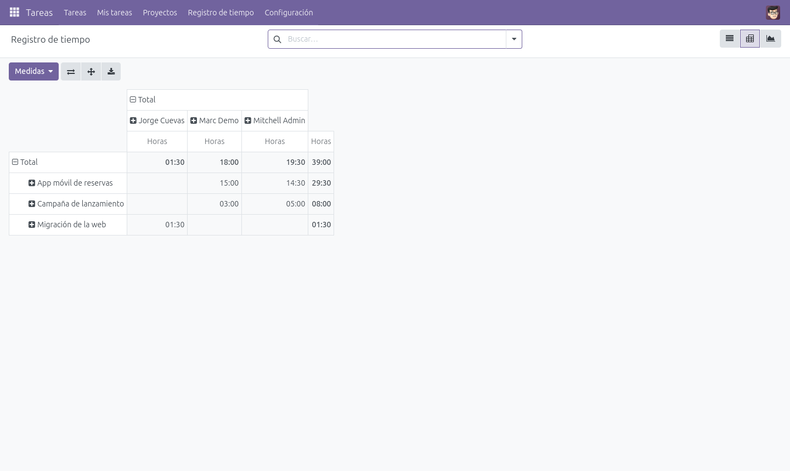
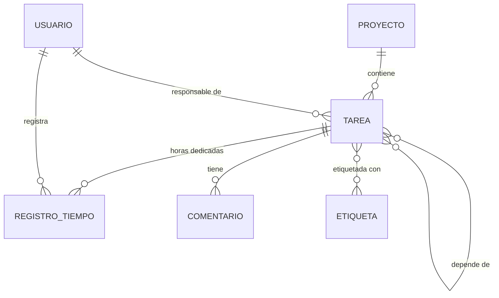

# 📋 Odoo Task Manager

[](https://github.com/Jocude/Odoo-TaskManager/actions/workflows/ci.yml)


Módulo de **Odoo 17** para gestionar proyectos y tareas: prioridades, dependencias entre tareas, registro de horas y seguimiento del progreso. Se levanta entero con **Docker Compose**, con datos de ejemplo y en español, sin instalar nada más.



---

## ✨ Funcionalidades

| | |
|---|---|
| **Proyectos** | Prioridad, fecha de vencimiento, coste, imagen y color. El progreso (% de tareas finalizadas) y las horas se calculan solos. Se pueden archivar. |
| **Tareas** | Responsable, prioridad (estrellas), etiquetas de colores, fechas y estados *Pendiente → En progreso → Finalizada*. La fecha de fin real se rellena sola al finalizar. |
| **Dependencias** | Una tarea puede depender de otras: mientras no estén finalizadas aparece como **bloqueada** y no se puede finalizar. Se detectan los ciclos. |
| **Registro de tiempo** | Partes de horas por tarea, usuario y día. Cada tarea muestra las horas dedicadas frente a las estimadas, y hay análisis por proyecto, usuario y semana. |
| **Retrasos** | Las tareas que pasan su fecha estimada sin terminar se marcan en rojo y se pueden filtrar. |
| **Comentarios** | Hilo de comentarios en cada tarea. |
| **Vistas** | Kanban con barra de progreso por estado, lista, formulario, calendario, pivot y gráfico. |
| **Seguridad** | Grupos *Usuario* y *Administrador*, y reglas para que cada uno solo modifique sus propios comentarios y partes de horas. |

## 📸 Capturas

| Tarea bloqueada por sus dependencias | Lista de tareas (retrasadas en rojo) |
|---|---|
|  |  |
| **Calendario de tareas** | **Horas por proyecto y usuario** |
|  |  |

---

## 🚀 Puesta en marcha

Solo hace falta **Docker** con el plugin de Compose.

```bash
git clone https://github.com/Jocude/Odoo-TaskManager.git
cd Odoo-TaskManager
docker compose up -d
```

La primera vez tarda unos segundos en crear la base de datos. Después:

- **Odoo:** http://localhost:8069
- **Usuario / contraseña:** `admin` / `admin`

El arranque crea la base de datos `tareas` con el español cargado, instala el módulo con datos de ejemplo (3 proyectos, 9 tareas con dependencias y partes de horas) y, en los siguientes arranques, actualiza el módulo con los cambios del código.

### Otros comandos

```bash
docker compose logs -f odoo                    # ver el log de Odoo
docker compose --profile herramientas up -d    # además, pgAdmin en http://localhost:8080
docker compose down                            # parar (los datos se conservan)
docker compose down -v                         # parar y borrar los datos
```

Los puertos, las contraseñas y el nombre de la base de datos se pueden cambiar copiando `.env.example` a `.env`. Los puertos solo se abren en `localhost`.

---

## 🧪 Tests

Hay 23 tests (`TransactionCase`) para la lógica de tareas, el progreso de los proyectos y la seguridad (permisos y reglas):

```bash
docker compose run --rm odoo -- -d test --test-enable --test-tags /jcd_tareas \
  -i jcd_tareas --stop-after-init
```

La **CI** (`.github/workflows/ci.yml`) se ejecuta en cada push y pull request:
- análisis y formato del código con [ruff](https://docs.astral.sh/ruff/);
- instalación del módulo con los datos de demo en Odoo 17 y PostgreSQL 15, y ejecución de los tests. Falla si algún test falla o si aparece cualquier error o aviso en el log.

---

## 🗂️ Estructura

```
├── addons/jcd_tareas/         # El módulo
│   ├── models/                # proyecto, tarea, registro_tiempo, comentario, etiqueta
│   ├── views/                 # Vistas, acciones y menús
│   ├── security/              # Grupos, permisos (ACL) y reglas de registro
│   ├── demo/demo.xml          # Datos de ejemplo (fechas relativas al día de instalación)
│   ├── tests/                 # Tests del módulo
│   └── hooks.py               # Deja al administrador en español al instalar
├── config/odoo.conf           # Configuración de Odoo
├── pgadmin/servers.json       # Conexión ya configurada para pgAdmin
├── docs/capturas/             # Capturas del README
├── docker-compose.yml
└── .env.example
```

### Modelo de datos



### Permisos

| | Usuario | Administrador |
|---|:---:|:---:|
| Ver, crear y editar proyectos y tareas | ✅ | ✅ |
| Borrar proyectos y tareas | ❌ | ✅ |
| Crear y editar etiquetas | ❌ | ✅ |
| Editar o borrar comentarios y partes de horas | Solo los suyos | Todos |

---

## 📄 Licencia

[GPL-3.0](LICENSE). Proyecto desarrollado por **Jorge Cuevas Delgado** a partir del entorno Docker de la asignatura de Sistemas de Gestión Empresarial ([javnitram/SGE-odoo-it-yourself](https://github.com/javnitram/SGE-odoo-it-yourself)).
